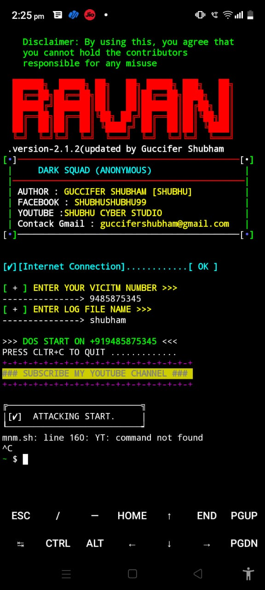
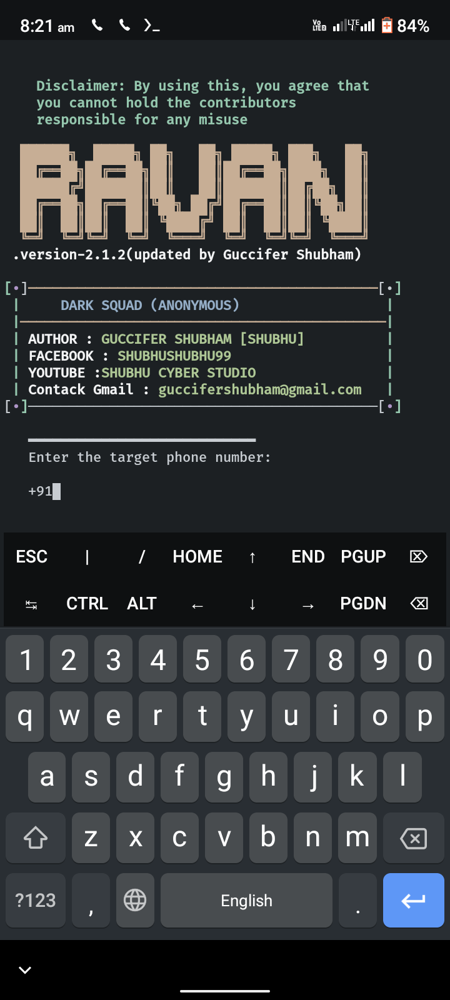

# Ravan

### [+] Created By <a href="https://github.com/shubhushubhu99">Guccifer Shubham</a>

### [+] Decription :
***Ravan is a tool to attack ddos on phone number. Best alternatives of TBomb with unlimted bombing feature.***

### [+] Installation

```apt install git ```

```git clone https://github.com/shubhushubhu99/Ravan.git```

```cd Ravan```

```bash Ravan2.sh[API DEAD]```

```python Ravan3.py[WORKING]```

### Dependencies

* to run this program make sure you've successfully installed or run tor in termux 
```pkg install tor [NO NEED IN RAVAN3]```

* to run the tor use a new session and type 
``` tor ```

### Or, Use Single Command
```
apt install git p && git clone https://github.com/shubhushubhu99/Ravan.git && cd Ravan && Ravan.sh 
```

### Features:
1. Unlimted Otp Bombing
2. Bombing with tor (full safety)
3. Stop call and msg of victim phone number

## Screenshots:

#### Main View:





## This repository is open source to help others. So if you wish to copy, consider giving credit!
 

## CONNECT WITH US :

[](https://www.messenger.com/t/100029217502143)
[](https://www.instagram.com/shubhushubhu99/)
[](www.darksquad.online)
[](https://www.linkedin.com/in/shubhushubhu99/)
[](https://www.facebook.com/darksquads)
[](https://t.me/darksquadbyshub1hacker)
[](https://chat.whatsapp.com/Lg4LzNPVDms4jiygADSLbZ)

## NOTE: UNINSTALL THE OLD VERSION OF RAVAN VIA rm -rf Ravan AND INSTALL THE NEW VERSION VIA SAME COMMAND
